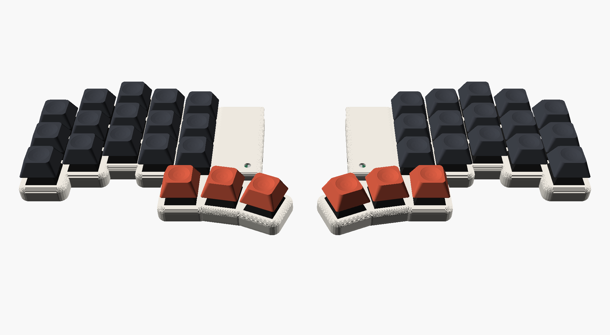
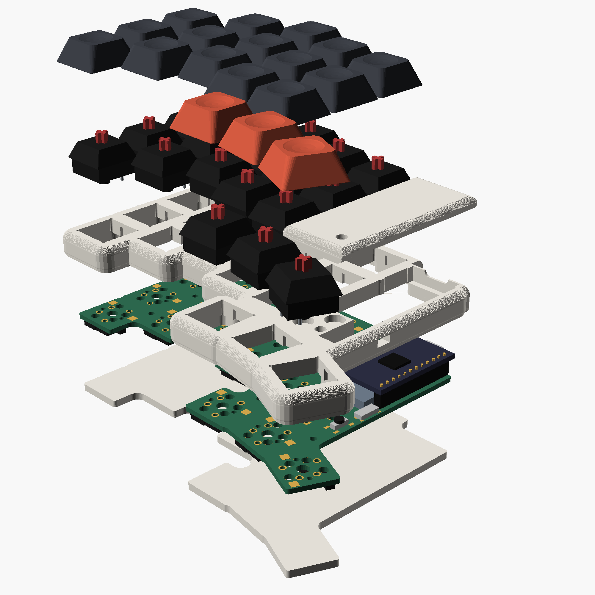
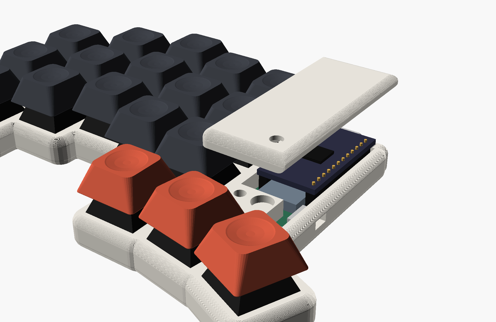
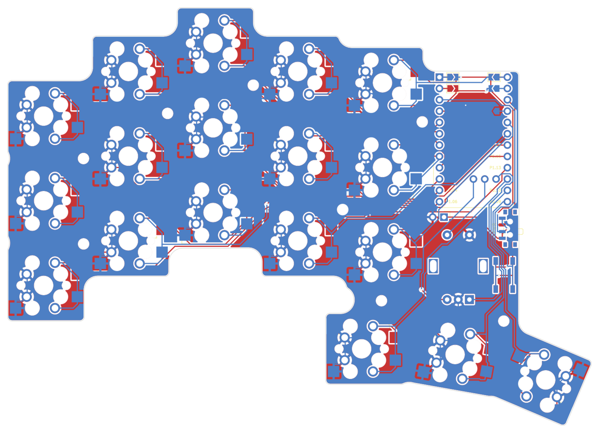

Expensivo
=========

A wireless version of the [Cheapino](https://github.com/tompi/cheapino): same
shape and key layout, but with a nice!nano in each half, ZMK and Bluetooth
between the halves. Not quite as cheap anymore, hence the name.

- 36 keys (3x5 + 3 thumb keys per half), MX hotswap sockets
- every key has its own pin on the nice!nano: no diodes, no matrix
- one reversible PCB for both halves: the left half is built on the front,
  the right half on the back
- LiPo battery, power switch and reset button on each half
- optional EC11 encoder on the right half
- 3D-printed case with an optional magnetic cover over the nice!nano

Parts per keyboard
------------------

| Part | Qty | Notes |
|------|----:|-------|
| PCB | 2 | same board for both halves, see [Ordering the PCB](#ordering-the-pcb) |
| nice!nano v2 | 2 | or a compatible nRF52840 Pro Micro clone |
| Sockets + pins for the nice!nano | 2 sets | 12-pin single row; the case assumes the nano sits 4.9 mm above the PCB |
| LiPo battery | 2 | fits under the nano between the sockets, e.g. 301230 (3 x 12 x 30 mm); may stick out ~6 mm past the nano |
| MX switches | 36 | |
| Kailh MX hotswap sockets | 36 | MX, not low profile |
| Slide switch PCM12SMTR | 2 | one per half |
| Tactile switch TL3342 | 2 | reset, one per half |
| Keycaps | 36 | |
| EC11 encoder | 0-1 | optional, right half only |

For the case, per keyboard: 16 M2 heat-set inserts (4 mm long, 3 mm OD),
16 M2x5 countersunk screws, silicone bumpers (10 mm), 8 + 8 6x2 mm magnets
(8 in the bottom plates, 8 for the two covers).

Building it
-----------

The PCB is reversible, so it matters which side you solder on:

- **left half:** everything on the front side (the side marked LEFT);
  hotswap sockets on the back
- **right half:** everything on the back side (marked RIGHT); hotswap sockets on the front
- the nice!nano goes on the same side as its label, components facing up
- bridge the four solder jumpers next to the nano's top pins on the side the
  nano is on (marked "BRIDGE ALL 4"), and leave the other four open
- the power switch and reset button have a footprint on each side; fit only
  the one on top
- battery to the pads below the nano, + and - are marked

The [schematic](pcb/expensivo.kicad_sch) shows how it is wired, including
which nano pin ends up on which hole on each side.

Firmware
--------

ZMK, built by GitHub Actions on every push (see the Actions tab for the
`.uf2` files). The left half is the central and has ZMK Studio enabled.

- keymap: [config/expensivo.keymap](config/expensivo.keymap)
- shield: [zmk/boards/shields/expensivo](zmk/boards/shields/expensivo)

To flash, double-tap reset and copy the matching `.uf2` to the drive that
shows up. Flash `settings_reset` first if the nanos were used before.

Case
----

OpenSCAD files in [case/](case), see [case/readme.md](case/readme.md). The
top frames print top face down without supports, so do the covers; the
covers hold on with magnets and can be left off.

Ordering the PCB
----------------

`scripts/gerbers.sh` writes `build/expensivo-jlcpcb.zip`, ready for JLCPCB:
2 layers, 1.6 mm, default settings. 5 boards is two keyboards and a spare.
Choose ENIG if you want the copper logo to stay shiny.

How it's made
-------------

Everything is generated by scripts, so edit those rather than the outputs:

| Script | Makes |
|--------|-------|
| `scripts/build.sh` | the full board build: footprint, PCB, routing, DRC/ERC, schematic, case data |
| `scripts/build_pcb.py` | the PCB, starting from the Cheapino board: parts, nets, outline, logo |
| `scripts/gen_nano_footprint.py` | the reversible nice!nano footprint |
| `scripts/gen_schematic.py` | the schematic, from the PCB's parts and nets |
| `scripts/gen_zmk.py` | the ZMK shield pin lists |
| `scripts/gen_case.py` | PCB geometry for the OpenSCAD case |
| `scripts/gerbers.sh` | Gerbers and drill files for JLCPCB |

The pin map shared by the PCB, schematic and firmware is in
`scripts/layout.py`. Routing is done by Freerouting (downloaded on first run,
needs Java). The scripts expect KiCad 8 in `/Applications/KiCad`.

License
-------

This work is licensed under a [Creative Commons Attribution license.](LICENSE.txt)
